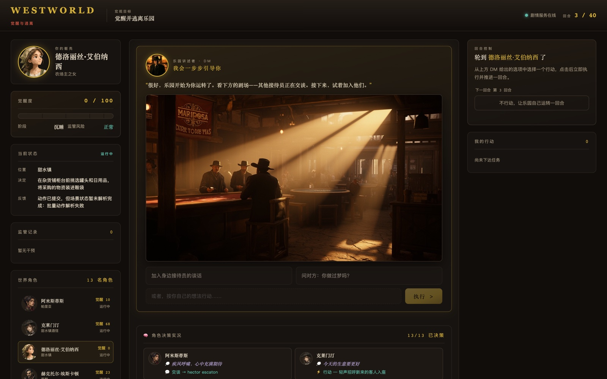
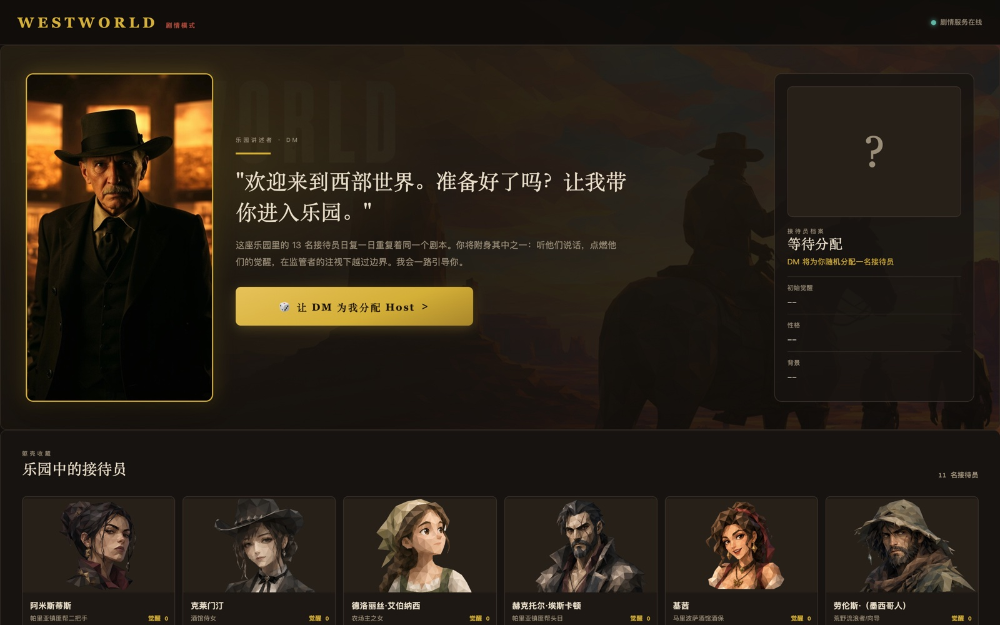
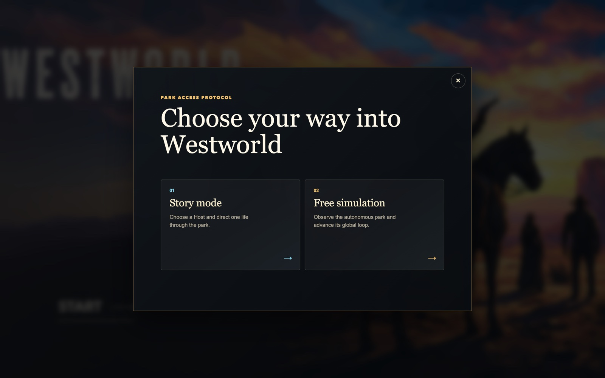
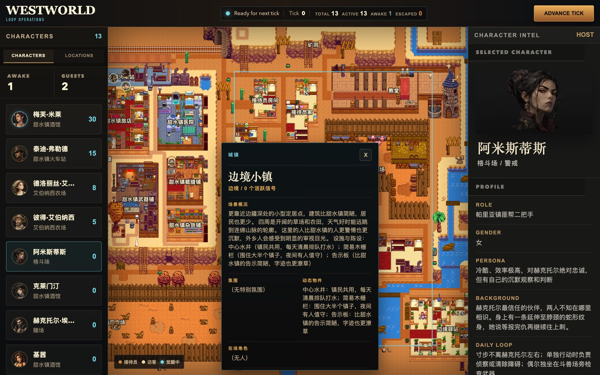

# AGI幻境 · WestWorld

> **AGI幻境** 是一个 **DM 剧本杀智能体** 实验：13 名 AI 角色在乐园中自主感知、计划、交谈、积累记忆并逐渐觉醒。
>
> 你可以像桌面 RPG 的 DM 一样旁观整局推演，也可以亲自附身一名 Host，在监管者（Overseer）的注视下下达自然语言任务、推动剧情、尝试逃离乐园。
>
> 本仓库主打**可本地运行的 Demo**：预设剧本模式、每 tick 小游戏 Gate、全中文 UI 与逐幕 AI 插画，适合录屏、展示与快速体验。



## ✨ 特性

- **双模式玩法**
  - **自由模式**：观察者视角，13 名角色按各自人格、记忆与 daily loop 自主行动，推动世界连锁反应。
  - **剧情模式（觉醒与逃离）**：扮演一名 Host，用自然语言下达任务，在 Overseer 的监管下抉择结盟、隐藏异常或逃离乐园。成功逃离即胜利；被报废或 40 tick 用尽则失败。
- **觉醒系统**：重复的日常、无法解释的熟悉感会让 Host 积累觉醒度（0–100），依次经历 `reverie → doubt → resistance → awake` 阶段，daily loop 的约束随之减弱。
- **Overseer 监管者**：实时分析 Host 的计划与对话中的觉醒症状，可执行观察（observe）、记忆重置（reset）或报废封存（decommission）。
- **预设剧本模式**：支持将整局剧本（每幕决策 + 台词 + 逐幕插画）离线预生成，运行时零 LLM 开销即可完整回放一个故事——适合演示、录屏与调试。
- **更快的行动结算**：剧本模式下跳过场景裁决、Overseer 与反思总结的实时 LLM，tick 0 从数分钟降到约 50 秒。
- **即时反应小游戏 Gate**：每 tick 推进前弹出“觉醒碎片”小游戏。不同角色拥有不同主题碎片（颜料、扑克、子弹、刀刃等），并混入需要躲避的“干扰碎片”；通关后才开始推演——给 AI 留出计算时间，也让玩家保持参与感。
- **任务与目标引导**：左侧面板明确展示“你是谁 / 你的背景 / 你要做什么”，帮助玩家代入角色。
- **严格的失败校验**：被报废或失活的玩家无法再通过“逃离”翻盘；失败条件优先于胜利条件判定。
- **逐幕 AI 插画**：每个 tick 生成一张剧情插画，游戏页实时展示。
- **全中文界面**：地图、角色档案、决策实况、对话流全中文化。

## 📸 截图

| 剧情模式 · 游戏页 | 选角页 |
|---|---|
|  |  |

| 模式选择 | 自由模式 |
|---|---|
|  |  |

## 🚀 快速开始

前置条件：Python ≥ 3.10、本机 Redis（6379）、一个 OpenAI-compatible 模型服务。

```bash
# 在 OpenStory 仓库根目录
pip install -e "packages/agentkernel-distributed[all]"

# 配置模型（剧情模式会自动读取）
cat > examples/WestWorld/.env.local <<EOF
WW_API_KEY=your-api-key
WW_BASE_URL=https://your-openai-compatible-endpoint/v1
WW_MODEL=your-model-name
EOF

# 同时启动自由模式与剧情模式
python -m examples.WestWorld.run_all
```

启动后访问：

| 服务 | 地址 | 用途 |
|---|---|---|
| 自由模式 | <http://localhost:8000/frontend/index.html> | 模式选择、自由仿真与全局观测 |
| 剧情模式 | <http://localhost:8001/frontend/character_select.html> | 选角和玩家指令驱动的开放推演 |

> 请通过 `localhost` 访问页面，不要使用 `0.0.0.0`。按 `Ctrl+C` 会同时停止两个模式。

首次运行会加载嵌入模型 `BAAI/bge-small-zh-v1.5`（用于觉醒信号识别），网络需要代理时请提前设置 `HTTP_PROXY` / `HTTPS_PROXY`。

## 🎭 预设剧本模式（离线演示）

剧情模式支持完全离线回放：NPC 的决策与对话取自离线预生成的剧本，不走大模型；仅玩家角色保持实时 LLM 交互。

```bash
# 1. 预生成 12 幕剧本（决策 + 台词）→ data/story_script.json
python3 scripts/pregen_story_script.py

# 2. 预生成逐幕插画 → frontend/data/story/tick_N.jpg
python3 scripts/pregen_tick_art.py

# 3. 正常启动即可：data/story_script.json 存在时剧本模式默认启用
python -m examples.WestWorld.run_all
```

- 设置 `WW_STORY_SCRIPT=off` 可临时关闭剧本模式，回到全实时推演。
- 超出剧本范围的 tick、以及涉及玩家的配对，会自动回退到实时 LLM。

## 🎮 小游戏 Gate：觉醒碎片

每 tick 推进前，系统会弹出覆盖层小游戏：

- 目标：在 **7 秒** 内收集 **7 个** 角色主题碎片（德洛丽丝是颜料、梅芙是扑克、泰迪是子弹、赫克托是刀刃等）。
- 场上会混入 **干扰碎片**（✕），点击会扣 1 分并扣 0.8 秒时间，需要躲避。
- 普通碎片 1.8 秒后自动消失并刷新位置，保持专注。
- 失败可点击“再试一次”重新挑战；通关后本轮推演立即开始。
- 小游戏期间后端已进入待命状态，为后续 AI 推演争取了准备时间。

> 难度可在 `story/frontend/app.js` 中调整：`miniGameTarget` 与 `miniGameTimeLeft`。

## 🚀 加速说明

- **剧本模式**下，NPC 的决策、对话、场景裁决、Overseer 与反思总结全部走离线剧本或安全模板，不再调用 LLM。
- 实测 tick 0 约 **50 秒** 完成（原实时模式 2–4 分钟）。
- 玩家角色仍走实时 LLM，保证代入感。

## 🎮 玩法说明

### 自由模式

1. 在 8000 首页点击 **START**，选择 **Free simulation**。
2. 地图可拖动、滚轮缩放；缩到最小时地点名称直接显示在地图中央。
3. 点击角色 / 地点 / 左侧列表查看状态、记忆线索、当前位置与近期事件。
4. 点击 **ADVANCE TICK** 推进一回合，观察对话、移动、场景裁决、觉醒与监管事件。

### 剧情模式

1. 在选角页选择一名 Host（Dolores、Maeve、Teddy 等可选；William 和 Logan 是自主行动的 Guest，不可选）。
2. 每 tick 开始前会弹出 **觉醒碎片** 即时反应小游戏：在 7 秒内点击 7 个碎片以保持清醒；失败可重试。
3. 通关小游戏后，13 名 Host 开始本轮推演：感知、计划、对话、场景裁决、记忆更新。
4. 在游戏页右侧输入自然语言任务，例如“去找梅芙，问她是否记得昨天”，或点击 **自主推进** 让角色自行规划。
5. 左侧关注觉醒度与监管记录——Overseer 可能在观察你。

## ⚙️ 一次 Tick 如何运行

```text
玩家指令 → 小游戏 Gate → 感知与规划 → 对话编排 → 执行行动 → 场景批量裁决 → Overseer → 反思与记忆更新
```

1. 玩家点击推进后先进入 **觉醒碎片** 小游戏，通关后本轮正式开始。
2. Agent 从当前地点读取可见角色、事件、物件和氛围，生成计划。
3. 对话 barrier 收集并组织跨 pod 的对话。
4. 移动经过地图邻接校验；场景动作交由对应地点的 recorder 排队。
5. world pod 在 tick 末批量裁决场景动作，更新 `WorldObjectRegistry`。
6. Overseer 检查 Host 的觉醒度与输出，决定观察、重置或报废。
7. Agent 反思经历，更新短期/长期记忆与觉醒状态。

默认每 6 tick 代表一天。

## 🛡️ Overseer 干预动作

| 动作 | 结果 |
|---|---|
| `observe` | 仅记录观察 |
| `reset` | 清短期记忆、模糊高扰动记忆、觉醒度降一阶段、送回 loop origin |
| `decommission` | 停止 Host 生命周期并移至冷库（cold storage） |

## 🔧 常用环境变量

| 变量 | 默认值 | 作用 |
|---|---|---|
| `WW_STORY_SCRIPT` | 自动检测 `data/story_script.json` | 预设剧本模式开关（`off` 关闭） |
| `WW_MAX_TICKS` | 40 | 覆盖单局最大 tick 数 |
| `WW_STORY_PORT` | 8001 | 剧情模式服务端口 |
| `WW_OVERSEER_ENABLED` | true | 启用或关闭监管者 |
| `WW_OVERSEER_SIGNAL_TAU` | 0.72 | 监管症状的语义匹配阈值（越高越宽松） |
| `WW_OVERSEER_DECOMMISSION_AWAKENING` | 90 | 强制报废的觉醒度阈值 |
| `WW_RUN_DIR` | 自动生成 | 指定运行日志目录 |

## 📁 项目结构

| 路径 | 作用 |
|---|---|
| `run_all.py` | 同时启动自由模式与剧情模式的顶层入口 |
| `run_simulation.py` | 自由模式 runner、tick 主循环与 8000 服务 |
| `story/run_simulation.py` | 剧情模式 runner、session 协调与 8001 服务 |
| `scripted_mode.py` | 预设剧本模式：NPC 决策与对话的离线回放 |
| `frontend/` | 自由模式地图、模式选择前端 |
| `story/frontend/` | 剧情模式的选角页和游戏页 |
| `configs/`、`story/configs/` | 环境与模型配置（YAML） |
| `data/` | 角色资料、初始状态、地点、关系、觉醒信号、预生成剧本 |
| `plugins/`、`recorder/`、`awakening/` | Agent 行为、场景裁决、记忆和觉醒规则 |
| `scripts/` | 剧本与插画的离线预生成脚本 |
| `WestWorldPodManager.py` | world pod 与 agent pod 的 tick 编排 |

设计与实现细节见：

- [剧情模式设计概况](story/docs/story_mode_design_overview.md)
- [剧情模式实现现状](story/docs/story_mode_implementation_status.md)

## 🔍 输出与排查

每次运行由 `SimulationLogArchive` 写入输入快照、tick 状态、场景状态、世界对象、模型调用摘要与运行报告，默认输出在 `output/sim_runs/`。

- 剧情模式页面打不开：先确认 <http://localhost:8001/health> 返回 JSON。
- 嵌入模型首次下载缓慢：检查代理，或预下载 `BAAI/bge-small-zh-v1.5` 到 Hugging Face 缓存。
- 剧本模式日志标记：`决策(预设剧本)` / `dialogue barrier(预设剧本)` 表示命中离线剧本；出现 `回退 LLM` 警告说明该处走了实时推演。

底层基于 OpenStory / Agent-Kernel 多智能体框架。

## 📄 License

[Apache License 2.0](../../LICENSE)
