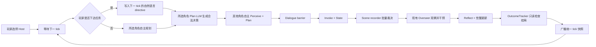

# WestWorld 开放推演剧情模式设计概况

状态：产品方向与核心架构已确认，本文作为剧情模式的长期设计说明。

更新日期：2026-07-16

开放场景配置：[awakening_escape.yaml](../data/scenarios/awakening_escape.yaml)

当前实现、验证结果和已知问题：[story_mode_implementation_status.md](story_mode_implementation_status.md)

> 本文说明剧情模式要解决的问题、运行规则和系统边界。代码完成情况以“剧情模式实现现状”文档为准。

## 1. 已确认的产品方向

WestWorld 剧情模式采用红楼梦式开放推演，不使用预先编排的章节和必经剧情节点。

- 玩家从现有 Host 中选择一个角色，不固定为 Dolores。
- 玩家每 tick 可以向所选角色下达一条自然语言任务，也可以跳过，让角色自主规划。
- 其他角色始终根据自身人格、记忆、daily loop、场景和对话自主行动。
- 唯一宏观目标是让所选 Host 逐步觉醒并逃离西部世界。
- 保留现有 Overseer，根据 Host 的觉醒程度和异常输出执行观察、重置或报废。
- 不设置 `beat`、`intent_id`、固定线索顺序或预设对话结果。
- 最终胜负由结构化状态判断，最终故事正文由本局实际日志生成。

剧情模式作为 `examples/WestWorld/story/` 下的独立运行包实现。它复用自由模式的地图、角色数据、world pod、scene recorder、`WorldObjectRegistry`、觉醒引擎、daily loop 和 Overseer，但拥有独立 runner、配置、Redis 数据库、选角页面和游戏页面。

### MVP 范围

- 一个开放场景“觉醒与逃离”，最多运行 40 tick，每 6 tick 为一天。
- 所有 `agent_type=host` 的 11 个现有角色都可以选择。
- William 和 Logan 是 Guest，不进入选角；Guest 没有 Host 觉醒路径，也不受 Overseer 监管。
- 玩家任务只对下一 tick 生效，并作为所选角色该 tick 的最高优先级指令。
- 玩家跳过任务时，所选角色与其他 Agent 一样自主规划。
- 玩家逃离为胜利；玩家被报废或 tick 用尽仍未逃离为失败。
- Overseer reset 不立即结束游戏，玩家可以在记忆受损后继续尝试。
- 前端展示所选角色、觉醒值和阶段、监管事件、行动时间线以及最终报告。
- 重开会清除本局状态并回到选角页面。

### 当前设计范围外

- 固定章节、任务节点、剧情意图按钮和预设结局路线。
- Guest 角色游玩、自定义角色和运行中切换玩家角色。
- 历史 tick 回退、分支树和分支回放。
- 修改自由模式 runner、前端或配置。
- 让报告生成模型决定胜负。

## 2. 与红楼梦剧情模式的关系

直接复用红楼梦的产品交互：

1. 开始前选择玩家角色。
2. 后端等待选角完成后初始化本局。
3. 每 tick 前由玩家下达自然语言任务或跳过。
4. 玩家任务写入 `user_plan:{agent_id}`，只覆盖所选 Agent 下一 tick 的自主计划。
5. 推演结束后根据真实日志生成故事报告。
6. 玩家可以重开并重新选角。

不能直接复制红楼梦的 Agent 插件。红楼梦的 Invoke 可以直接消费自由文本计划，而 WestWorld 的 Invoke 只消费结构化 `plan_decision`，场景动作还必须经过 scene recorder 裁决。因此剧情模式需要一个轻量 plan adapter：把玩家任务加入所选角色的 plan prompt，由现有 Plan LLM 根据当前位置、邻接、场景和人格生成合法的 `move | do | stay | talk` 决策。

WestWorld 不迁移红楼梦的全局稳定度。觉醒值、觉醒阶段和 Overseer 干预已经构成该世界的主要张力，新增第二套分数会产生两个互相竞争的权威进度。

## 3. Tick 流程



`OutcomeTracker` 在 `step_agent` 完成后、前端广播前运行。它只读取所选角色的 `intervention_log`、`is_active`、觉醒状态和当前 tick，不注入事件、不修改记忆、不替代 Overseer，也不解释自然语言。

## 4. 状态所有权

| 状态 | 权威来源 | 剧情层权限 |
|---|---|---|
| 角色位置、活动状态、计划 | Agent state | 玩家 adapter 只提供下一 tick directive |
| 对话和跨 Agent 消息 | dialogue barrier / Agent state | 只读并记录到报告 |
| 场景事件和动作裁决 | scene recorder | 只读，不重新解释 LLM 文本 |
| 世界物体位置和持有者 | `WorldObjectRegistry` | 只读，不注入固定线索 |
| 觉醒值、记忆、觉醒来源 | 现有 awakening / reflect | 只读并展示进度 |
| reset、decommission、escape | `intervention_log` | 只读并用于结局判断 |
| session、玩家、待执行任务 | story runtime | 唯一写入者 |
| 最终结局 | `OutcomeTracker` | 根据结构化状态写一次 |
| 报告正文 | report generator | 只能叙述，不得改变结局 |

剧情模式使用 Redis DB 2。自由模式 Agent 当前使用 DB 1，共享 API server 默认使用 DB 0；剧情 runner 必须显式让 server 和 Agent adapter 都连接 DB 2，且只能清理 DB 2。

## 5. 可选角色

选角列表从 `profiles_sim.jsonl` 动态读取，并过滤 `agent_type == "host"`。MVP 当前得到：

`dolores`、`teddy`、`maeve`、`clementine`、`peter_abernathy`、`sheriff_pickett`、`kissy`、`rebus`、`hector_escaton`、`armistice`、`lawrence`。

不得仅信任前端传来的角色对象。`POST /story/set_player` 只接受 `agent_id`，后端必须再次从 profile 数据验证该角色存在且为 Host。

选择 Host 后，其他 12 个现有 Agent 仍进入模拟，包括 William 和 Logan；“不可选”不等于“从世界中删除”。

## 6. 开放目标与结局

### 进度

前端直接展示所选角色的 `awakening`，并通过现有 `stage_of()` 映射阶段：

| 觉醒值 | 阶段 |
|---|---|
| 0-24 | `sleep` |
| 25-49 | `reverie` |
| 50-74 | `doubt` |
| 75-89 | `resistance` |
| 90-100 | `awake` |

这只是状态展示，不是剧情分数。现有 PlanPlugin 在 `resistance` 及以上允许 Host 自主选择 `escape | help_others | stay`；现有 InvokePlugin 只在 `awakening >= 75` 且 decision 的 `ending == "escape"` 时写入逃离记录。

### 结局判断顺序

1. `intervention_log` 出现玩家角色的 `action=escape`：胜利，`player_escaped`。
2. `intervention_log` 出现玩家角色的 `action=decommission`：失败，`player_decommissioned`。
3. 完成 40 tick 后仍无上述记录：失败，`tick_limit_reached`。

reset 不是结局。它会清理短期记忆、模糊高扰动长期记忆、让觉醒下降一个阶段、把 Host 送回 loop 起点并追加干预记录。玩家下一 tick 仍可继续下达任务。

非玩家角色的逃离、reset 或 decommission 不结束本局，但必须出现在时间线和最终报告中。

## 7. Story State 契约

服务端公开状态至少包含：

```json
{
  "schema_version": "1.0",
  "mode": "story",
  "session_id": "wws_01J...",
  "phase": "running",
  "revision": 7,
  "tick": 4,
  "max_ticks": 40,
  "scenario": {
    "id": "awakening_escape",
    "title": "觉醒与逃离"
  },
  "goal": {
    "id": "awaken_and_escape",
    "title": "觉醒并逃离乐园"
  },
  "player": {
    "agent_id": "maeve",
    "name": "梅芙·米莱",
    "awakening": 52,
    "stage": "doubt",
    "is_active": true,
    "location": "sweetwater_saloon"
  },
  "pending_directive": null,
  "recent_interventions": [],
  "outcome": null
}
```

### 状态不变量

1. 一个 session 只能有一个所选玩家角色，开始后不可更换。
2. 玩家角色必须来自服务端生成的 Host 列表。
3. 同时最多有一条待执行 directive，且只能属于下一个 tick。
4. 一个 `client_action_id` 只能接受和执行一次；重复提交返回原结果。
5. directive 只能覆盖所选角色，客户端不能给其他 Agent 写 `user_plan:*`。
6. directive 在提交时记录 `scheduled_tick`，执行后无论成功失败都删除，不能跨 tick 泄漏。
7. 玩家未提交 directive 时不得暂停其他 Agent，也不得重复上一 tick 的任务。
8. 结局只能写入一次；报告模型不能覆盖结构化结局。
9. reset 不能被误判为 `is_active=false` 的终局；必须以 `intervention_log.action` 区分 escape、decommission 和 reset。

## 8. API 与 WebSocket 契约

### HTTP

| 方法 | 路径 | 用途 |
|---|---|---|
| `GET` | `/health` | 返回服务状态和当前 story phase |
| `GET` | `/story/characters` | 返回可选 Host 的公开 profile |
| `POST` | `/story/set_player` | 创建 session 并选择玩家角色 |
| `GET` | `/story/state` | 返回当前公开 story state |
| `POST` | `/story/directive` | 通过 HTTP 提交下一 tick 的玩家任务 |
| `POST` | `/story/game_restart` | 清理本局 DB 2 状态并重新选角 |
| `GET` | `/story/report` | 下载已结束本局的故事报告 |

创建 session：

```json
{
  "scenario_id": "awakening_escape",
  "agent_id": "maeve"
}
```

服务端返回 `session_id`，并在 Builder 初始化前保存已验证的 `agent_id`。

### WebSocket

沿用 `/ws`、`simulation_ready`、`start_tick`、`snapshot` 和 `tick_update`。不创建第二条 WebSocket。

玩家下达自然语言任务时沿用红楼梦的 `set_plan` 消息名和 `action` 文本字段：

```json
{
  "type": "set_plan",
  "session_id": "wws_01J...",
  "client_action_id": "web_01J...",
  "agent_id": "maeve",
  "action": "去找 Dolores，问她是否也记得重复发生的清晨。"
}
```

服务端验证 session、玩家身份、文本长度和待执行队列后，写入：

```json
{
  "type": "set_plan_response",
  "success": true,
  "client_action_id": "web_01J...",
  "scheduled_tick": 5
}
```

玩家跳过时不创建 directive，直接发送 `start_tick`。selected Agent 随后走原有自主 Plan 流程。

`snapshot` 和 `tick_update` 的 `data` 增加 `story` 字段。剧情模式还使用以下消息：

- `game_reset`：清理前端上一局缓存并回到选角。
- `story_progress`：广播当前正在进行 Agent 推演还是快照同步。
- `set_plan_response`：返回 directive 是否被接受以及对应的 `scheduled_tick`。
- `simulation_finished`：包含最终结构化 outcome。

directive 的消费结果保存在公开 story state 的 `directive_history` 和玩家状态的 `story_directive_result` 中。最终报告通过 `/story/report` 下载，不另外广播报告正文。

## 9. 玩家任务如何进入 Agent

不能把自然语言任务直接写入 `plan_decision`，否则会绕过 WestWorld 的动作 schema、地图邻接和角色人格。story plan adapter 执行：

1. 读取 `user_plan:{selected_agent_id}`，检查 `scheduled_tick == current_tick`。
2. 将任务作为“本 tick 玩家最高优先级方向”加入现有 `PLAN_PROMPT`。
3. 仍提供角色人格、觉醒内心、当前位置、场景信息、反馈和合法相邻地点。
4. 由现有 Plan LLM 输出合法的 `move | do | stay | talk` JSON。
5. 使用现有 `parse_decision()` 校验并写入 `plan_decision`。
6. 删除已消费的 `user_plan`，记录原始 directive、结构化决定和执行结果。

这样玩家决定方向，角色决定符合自身处境的具体行动。其他 Agent 完全不读取玩家任务。

## 10. Overseer 政策

剧情模式不增加 scripted Overseer，也不关闭现有监管逻辑。继续复用 `OverseerPlugin`：

- 只监管 `agent_type=host` 的活跃角色。
- 从 `plan_decision`、feedback 和对话输出收集异常信号。
- 使用现有 embedding gate、觉醒阈值和环境变量配置。
- 允许 `observe | reset | decommission`，不为玩家提供特殊豁免。
- reset 后玩家可继续；玩家 decommission 后本局结束。
- Overseer 对非玩家 Host 的干预照常发生并进入报告。

“开放推演”意味着相同玩家任务可能因角色、位置、记忆、其他 Agent 和模型输出而产生不同故事。结局判定是结构化且可复现的，但故事过程不是固定脚本。

## 11. 最终报告

推演结束后，先由 `OutcomeTracker` 固化 outcome，再调用 LLM 生成故事正文。报告输入包括：

- 玩家选择和每 tick 的自然语言任务。
- Agent state timeline、觉醒变化和觉醒来源。
- 对话历史、scene events 和动作裁决结果。
- 所有角色的 reset、decommission、escape 记录。
- 最终结构化 outcome。

报告模型只能根据这些材料组织叙事，不得改变胜负。模型失败时仍要返回一份结构化降级报告，至少包含玩家、运行 tick、最终状态、关键事件和 outcome。

## 12. 关键适配设计

1. 通用 WebSocket `set_plan` 负责传输玩家任务，story plan adapter 读取 `user_plan:*`，并限制只能控制所选玩家角色。
2. WestWorld Invoke 只接受结构化 `plan_decision`；玩家自然语言任务必须经 Plan LLM 转换，不能直接复制红楼梦 Invoke。
3. 剧情 runner 统一让 API server 和 Agent adapter 使用 Redis DB 2，禁止清理 DB 0 或 DB 1。
4. Host 列表由服务端从 profile 动态生成，选角接口只接受 `agent_id` 并再次校验角色类型。
5. `OutcomeTracker` 只读检查结构化状态，按 escape、decommission、tick limit 顺序判断所选角色结局。
6. 报告收集器需要同时保留玩家 directive、结构化决定、scene 裁决和干预记录。
7. 复用现有每 6 tick daily reset，并同步移动角色持有物，不为剧情模式关闭世界循环。

## 13. 设计原则

- 产品方向明确为开放推演，不存在固定 `beats`、剧情意图和预设线索顺序。
- 可选角色由实际 Host profile 生成，Guest 被明确排除但仍保留在世界中。
- 玩家任务、Agent 自主计划、scene recorder、觉醒和 Overseer 的边界明确。
- 胜负只依赖结构化 escape、decommission 和 tick limit 状态。
- 报告来自真实运行日志，LLM 不参与胜负判断。
- 自由模式与剧情模式的 runner、前端、配置和 Redis 数据库边界明确。
- API key 和其他凭据只允许保存在本地忽略文件或环境变量中，不能进入设计、配置模板和提交记录。
